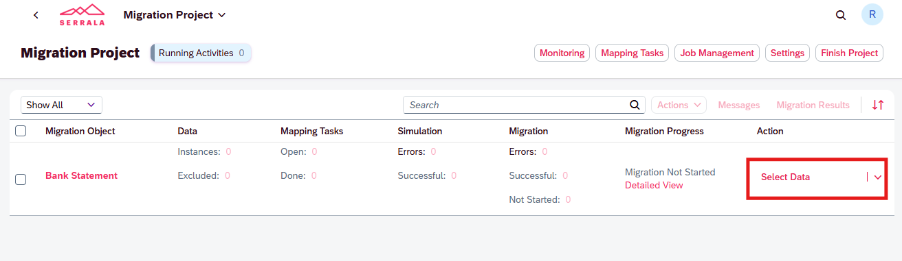
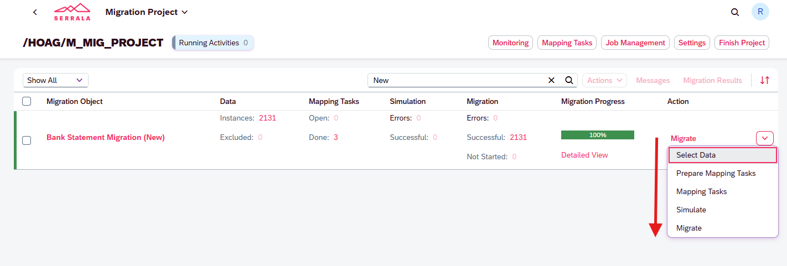
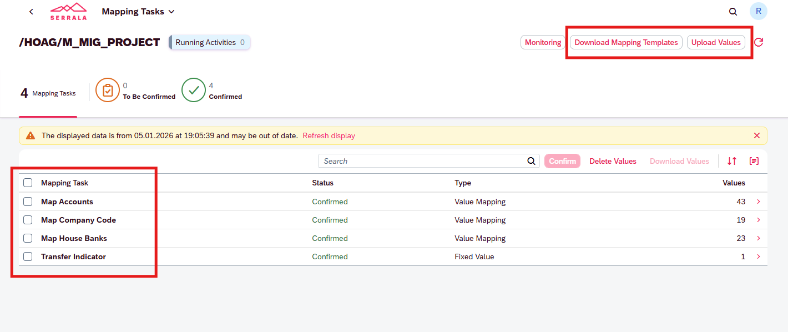
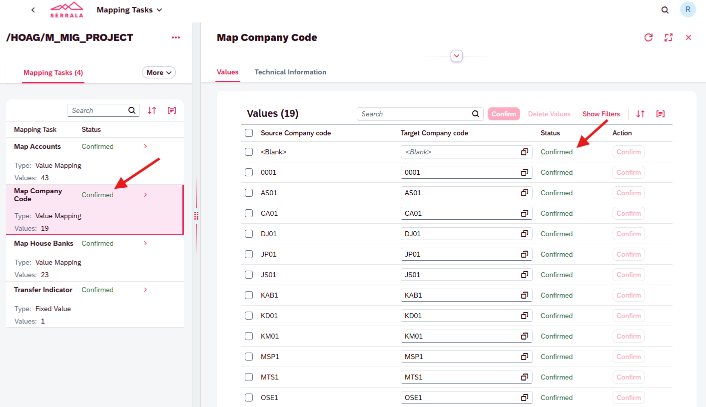
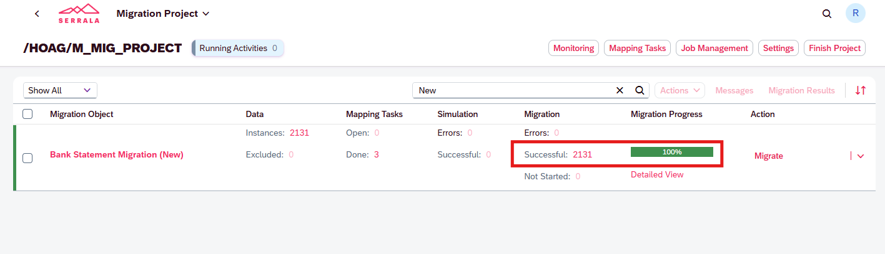

# ECC → S/4HANA Data Migration (Direct)

This document describes the **actual data migration flow from ECC to S/4HANA**, executed directly using migration objects.  
Each step is executed via **background jobs**, and **detailed logs with messages** are available to the user at every stage.

---

## Migration Flow Overview

The migration consists of the following sequential steps:

1. Select Data  
2. Prepare Mapping Tasks  
3. Mapping Tasks  
4. Simulation  
5. Migration  

---

## 1. Select Data

The migration process starts by selecting the data for a specific **Migration Object** (e.g., *Bank Statement*).

- Navigate to **Migration Project**
- Choose the migration object
- Click **Select Data** from the Action menu

---

## 2. Prepare Mapping Tasks

Once data is selected, required mapping tasks are generated automatically.

Key features:
- Mapping tasks are created based on source data
- Users can **download mapping templates (Excel)**
- Mapping values can be **uploaded back via Excel**

---

## 3. Mapping Tasks

Mapping tasks must be completed and confirmed before simulation.

Typical mapping tasks include:
- Map Accounts  
- Map Company Code  
- Map House Banks  
- Fixed Values (e.g., Transfer Indicator)

Features:
- Value-level confirmation
- Status tracking (Confirmed / To Be Confirmed)
- Bulk upload supported via Excel

  

---

## 4. Simulation

Simulation validates the migration without posting data.

- Executed as a **background job**
- Checks data consistency and mappings
- Errors (if any) are logged and displayed

Simulation status is visible directly in the Migration Project overview.

---

## 5. Migration

After a successful simulation, the actual migration is executed.

- Runs as a **background job**
- Progress shown as percentage
- Success, error, and not-started counts displayed
- Detailed logs available via **Detailed View**

---

## Logging & Monitoring

- Every step runs in the background
- Complete execution logs with messages are available
- Errors and successes are fully traceable per object and per step

