# Migration Object Creation (Migration Object Modeler)

This document describes the **end-to-end creation of a user-defined Migration Object** using the **Migration Object Modeler** for the **Direct Transfer (ERP → SAP S/4HANA)** approach.

The example shown is a custom **Bank Statement** migration object (`Z_BANK_STATEMENT_01`) and covers **source modeling, target API integration, structure & field mapping, and value mappings**.

---

## Step 1: Create Migration Object

Start by creating a **user-defined migration object** based on the *Direct Transfer* approach. This determines that data will be read directly from the SAP ERP source system via RFC.

Key activities:

* Launch **Migration Object Modeler**
* Choose **Create Migration Object → User-Defined → Migrate Data Directly from SAP System**
* Assign the migration project
* Provide business name and technical name

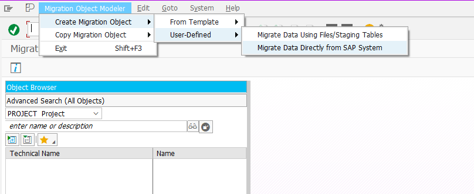

---

## Step 2: Select Source Tables & Define Relationships

Define the **data model of the source system** by selecting all required tables. One table acts as the **root**, with dependent tables linked via foreign keys.

Key activities:

* Add root and dependent source tables
* Define parent–child relationships
* Maintain foreign key field mappings

This ensures consistent data extraction during migration.

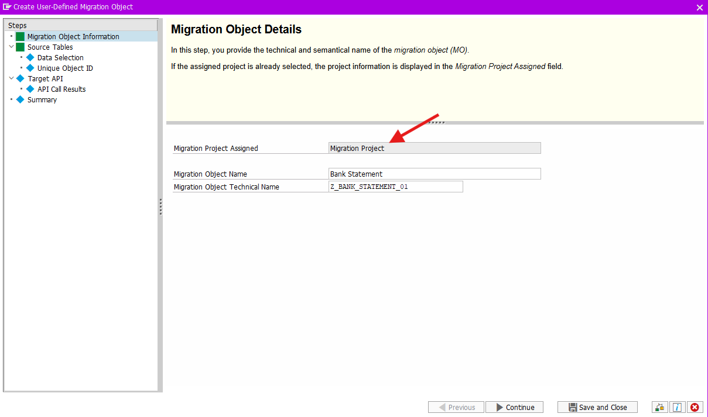

---

## Step 3: Define Unique Object ID

The **Unique Object ID** defines how a single business object instance is identified during migration. This is critical for avoiding duplicates and ensuring correct processing.

Key activities:

* Select one or more key fields from the root table
* Use a composite key when a single field is insufficient

Example identifiers include company code, bank ID, account ID, and statement number/date.

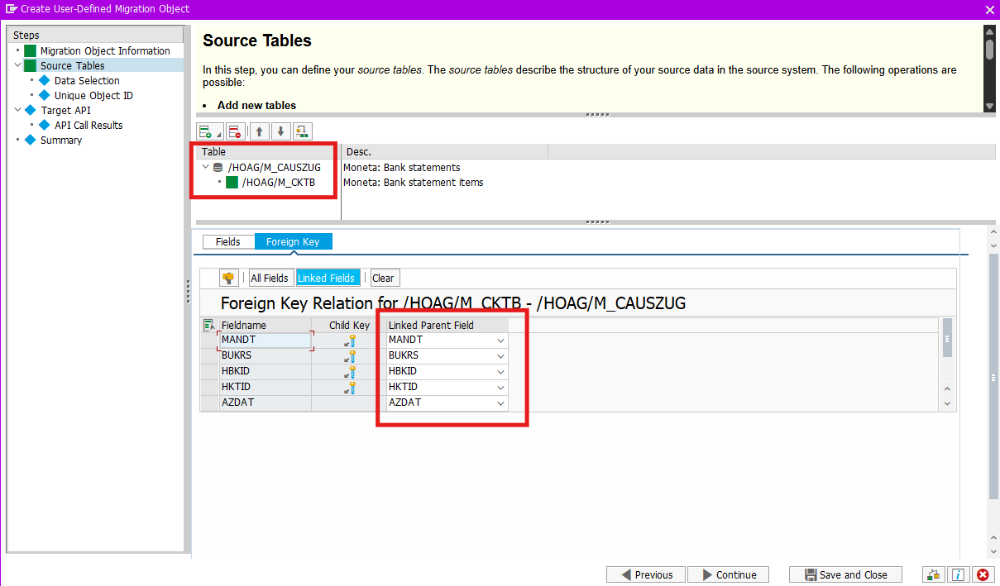

---

## Step 4: Maintain Data Selection

Define how data will be filtered during extraction. This controls **which records** are considered for migration.

Key activities:

* Choose filtering strategy
* Option used here: **Define selection later**

This allows organizational filters (e.g. company code) to be applied at project or runtime level.

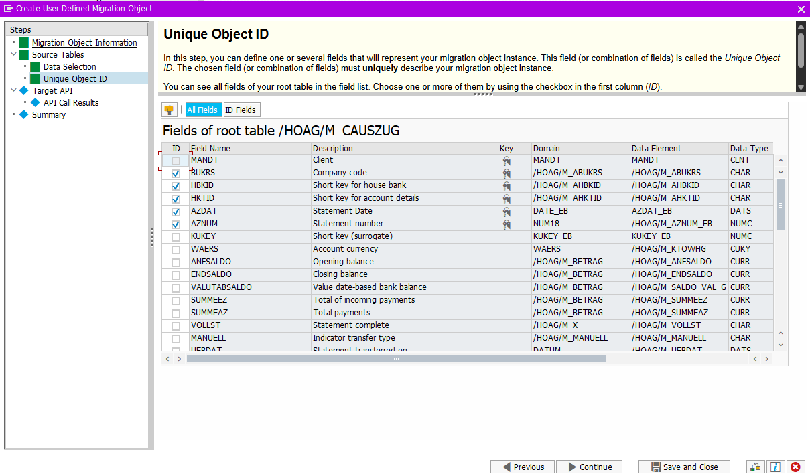

---

## Step 5: Define Target API

Assign the **target function module** responsible for creating data in SAP S/4HANA. This API represents the posting logic on the target system.

Key activities:

* Select the appropriate function module
* Enable simulation mode for test runs
* Define simulation parameters

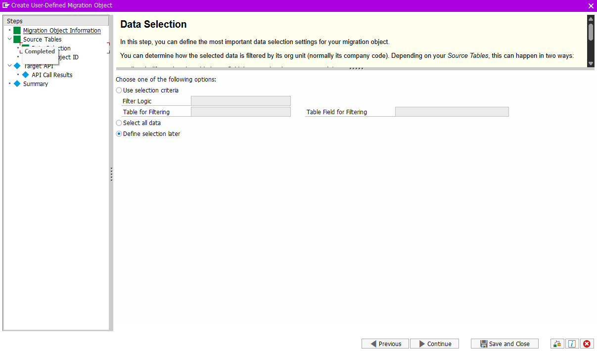

---

## Step 6: Maintain API Call Results

Configure how the Migration Cockpit determines **success or failure** of each API call.

Key activities:

* Assign success indicators (e.g. boolean flags)
* Map return message tables (BAPIRET2)
* Define evaluation logic

This step is essential for proper error handling and monitoring.

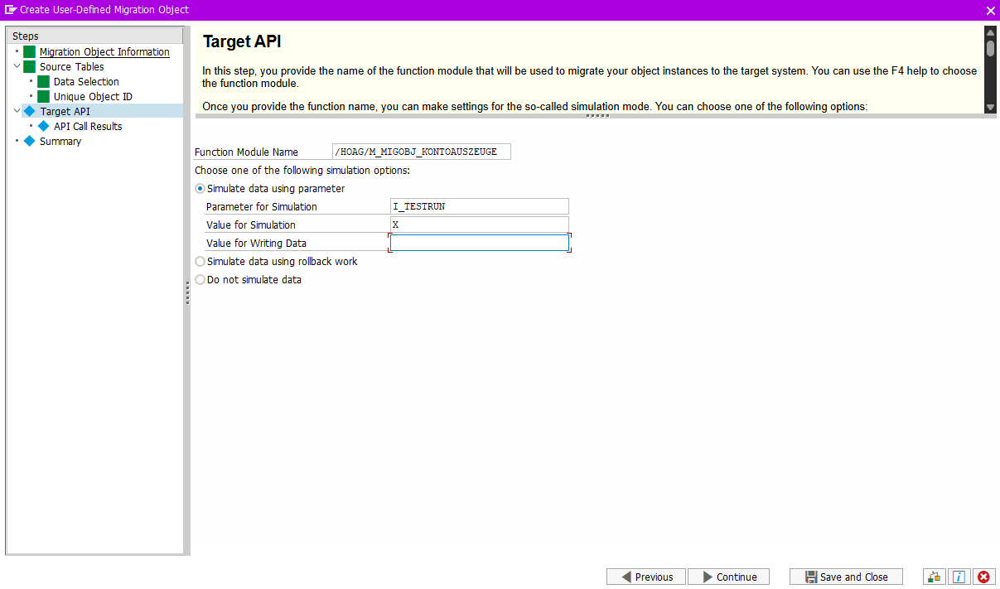

---

## Step 7: Review & Complete Object

Review the overall configuration before finalizing the migration object.

Key activities:

* Verify source tables and target API
* Check simulation and success evaluation flags
* Complete and save the object

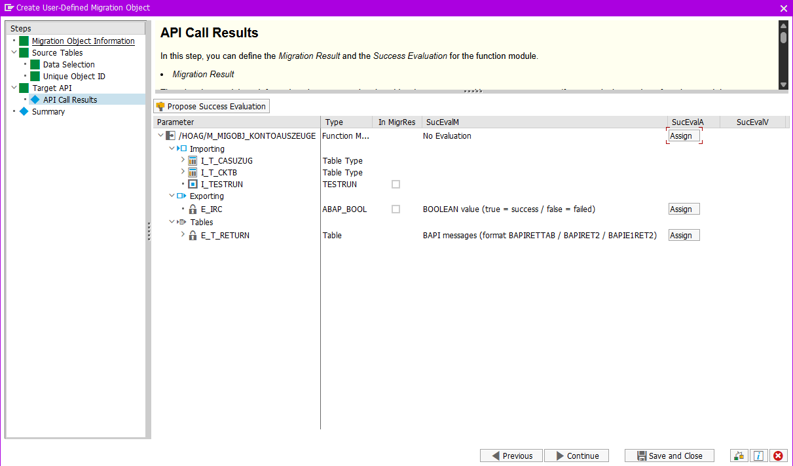

---

## Step 8: Structure Mapping

Map **source table structures** to the corresponding **target API structures**. This defines how datasets are passed to the API.

Key activities:

* Assign internal tables to API parameters
* Validate correct structural alignment

---

## Step 9: Field Mapping

Define how individual fields from the source tables populate the target API fields.

Key activities:

* Direct field-to-field mapping
* Identify fields requiring transformation
* Prepare fields for rule-based mapping

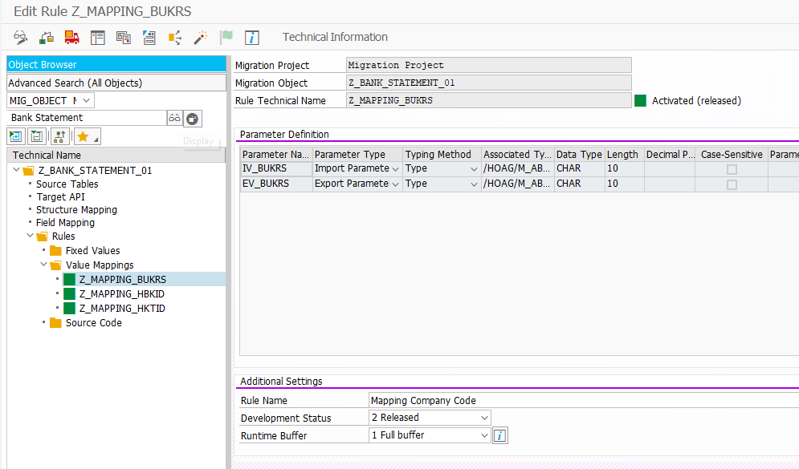

---

## Step 10: Create Value Mapping Rules

Create reusable **value mapping rules** to transform source values into target-compatible values.

Key activities:

* Define importing parameters (source values)
* Define exporting parameters (mapped values)
* Activate and release rules

Typical use cases include company code, bank key, and account ID mapping.

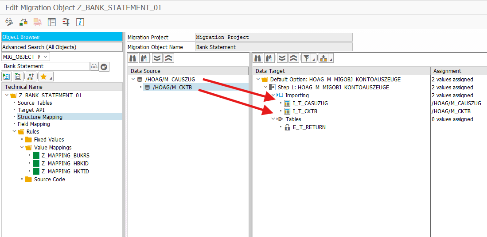

---

## Step 11: Assign Rules to Target Fields

Apply the created value mapping rules to target fields during field mapping.

Key activities:

* Assign rule to target field
* Bind importing and exporting parameters
* Verify rule assignment

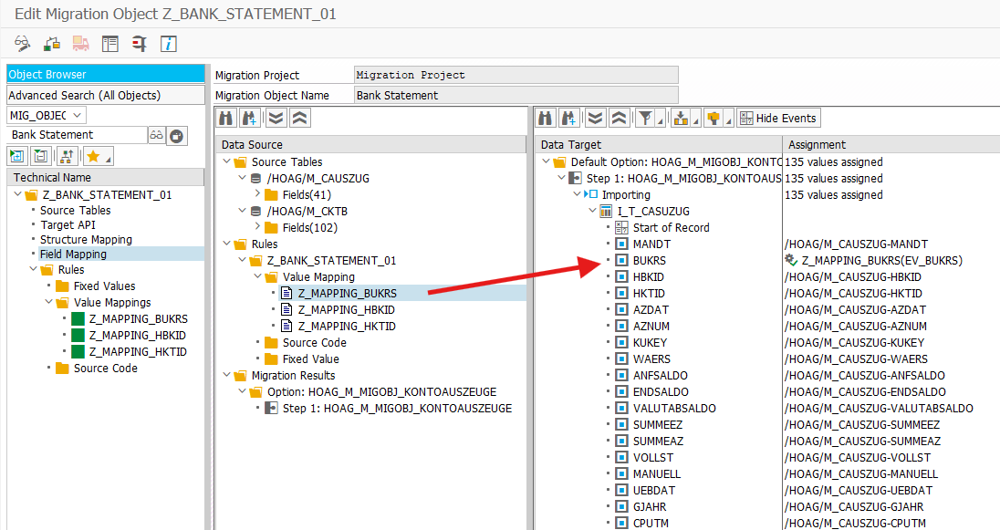

---

## Step 12: Validate Complete Mapping

Perform a final validation to ensure the migration object is technically complete.

Key activities:

* Ensure all mandatory fields are mapped
* Confirm all rules are active
* Resolve missing assignments

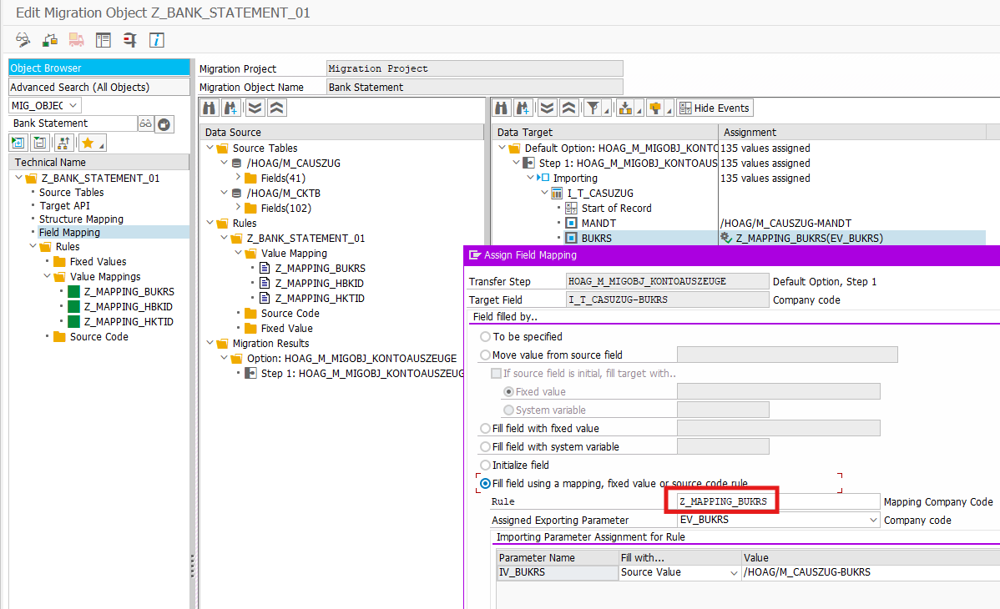
