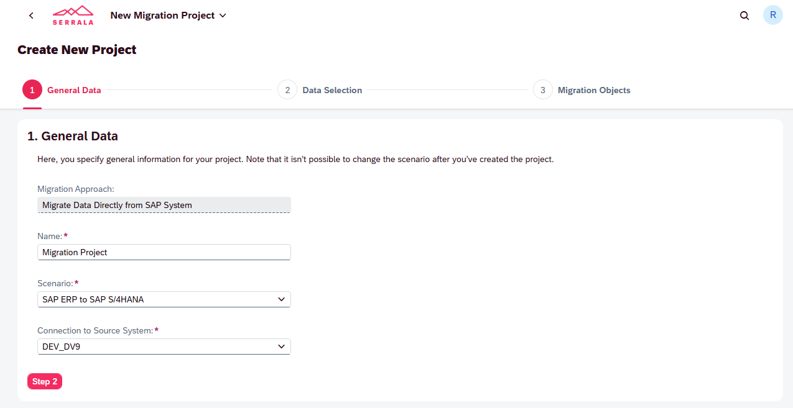
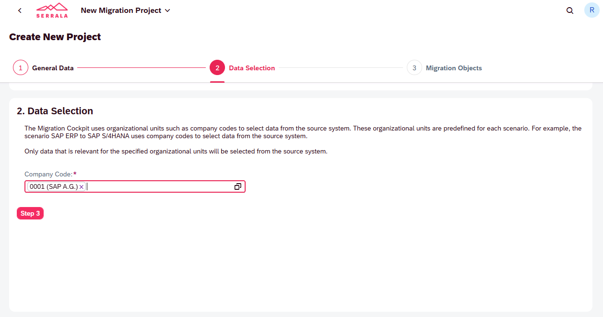
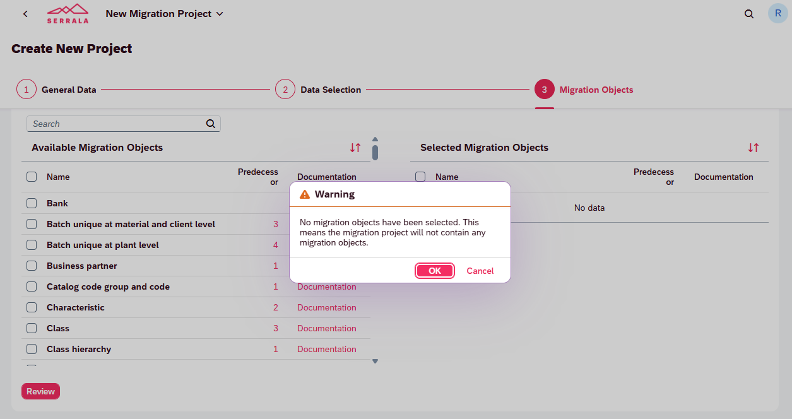
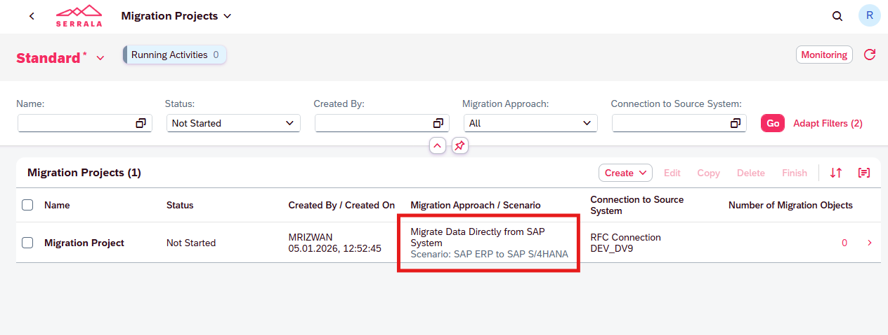

# Migration Project Creation (Fiori App)

This document explains how to create a **Migration Project** using the **SAP S/4HANA Migration Cockpit** Fiori app for the scenario **SAP ERP → SAP S/4HANA (Direct Transfer)**.

The process is completed in **4 simple, guided steps**.

---

## Step 1: Maintain General Data

In this step, you define the **core attributes** of the migration project. These settings are **locked after project creation**.

**Actions:**

1. Open the Fiori app **Migrate Your Data**
2. Choose **Create** → *Migration Project*
3. Maintain the following fields:

* **Migration Approach**: *Migrate Data Directly from SAP System*
* **Project Name**: Meaningful business name
* **Scenario**: *SAP ERP to SAP S/4HANA*
* **Connection to Source System**: RFC destination to SAP ERP

> ⚠️ The migration scenario **cannot be changed later**.

---

## Step 2: Select Data (Organizational Units)

The Migration Cockpit selects data from the source system **based on organizational units**. For the ERP → S/4HANA scenario, this is typically **Company Code**.

**Actions:**

1. Select one or more **Company Codes**
2. Only data belonging to these units will be considered for migration

> 📌 Data outside the selected organizational units is **ignored** by the Migration Cockpit.

---

## Step 3: Review Migration Objects

In this step, you review and (optionally) select **migration objects**.

**Key behavior:**

* Migration objects are **derived automatically** based on:

  * Selected scenario
  * Selected organizational units
* It is **valid** to proceed without selecting any migration objects initially

**System Message Explained:**

> *“No migration objects have been selected.”*

This message is **informational**, not an error. Migration objects can be selected or adjusted later.

---

## Step 4: Project Creation Confirmation

After completing the wizard, the migration project is created and visible in the **Migration Projects** overview.

**Project Status:**

* Initial status: **Not Started**
* Number of migration objects: **0** (expected at this stage)

This confirms:

* RFC connection is working
* Scenario and approach are correctly assigned
* Project is ready for migration object configuration

---

## Outcome

✔️ Migration Project successfully created
✔️ Scenario locked: *ERP → S/4HANA*
✔️ Ready for **Migration Object selection and execution**

---

> 📌 **Next Step**: Proceed to *Migration Object Creation & Dependency Management*.
